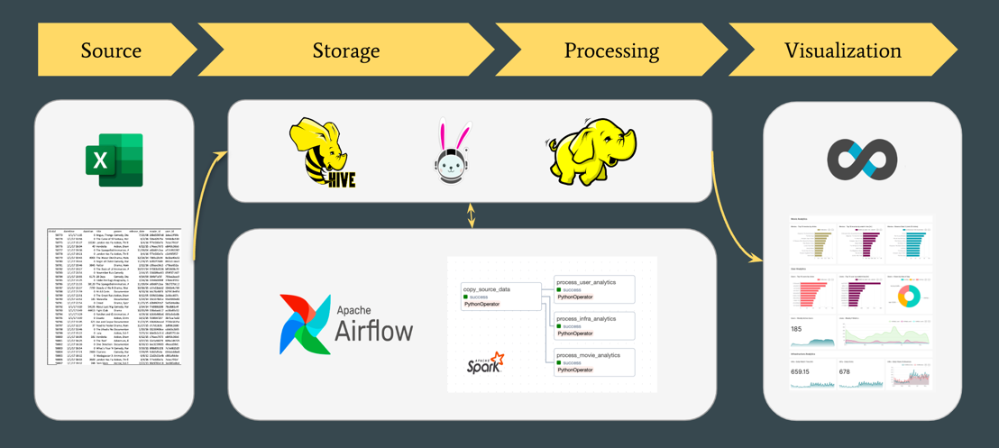

### Instructions to setup Airflow

1. cd `infrastructure/airflow`
2. Build the image `docker-compose build`
3. Airflow init `docker-compose up airflow-init`
4. Run the container `docker-compose up -d`

### Instructions to setup Trino

1. cd `infrastructure/trino-hdfs3`
2. Run the container `docker-compose up -d`

### Instructions to setup Superset

1. cd `infrastructure/superset`
2. Run the container `docker-compose up -d`

### Demo Architecture Diagram

### OSDS Presentation

[Presentation Link](https://docs.google.com/presentation/d/11dIkphkAH-SC1JBWZzOa0jIlg5W0OQEsBMHhmCkc7RQ/edit?usp=sharing)
